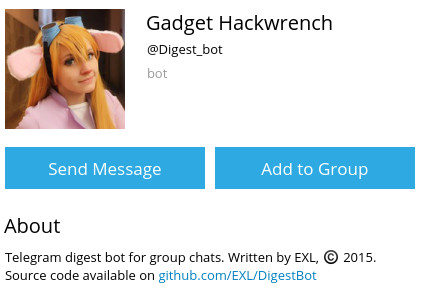

Digest Bot
=============



Telegram digest bot for group chats.
Bot records all messages with the #digest tag and displays them on the /digest command.
Thanks to the creators of [node-telegram-bot-api](https://github.com/yagop/node-telegram-bot-api) and the creators of powerful and awesome JavaScript framework — [Node.js](https://nodejs.org/en/)

## Install instructions

For example, GNU/Linux:

* Install the "Node.js" and the "npm" Node.js package manager;

```sh
sudo apt-get install nodejs
sudo apt-get install npm
```

* Clone repository into deploy directory;

```sh
cd ~/Deploy/
git clone https://github.com/EXL/DigestBot DigestBotDeploy
```

* Install "node-telegram-bot-api" and "request" modules into deploy directory;

```sh
cd ~/Deploy/DigestBotDeploy/
npm install
```

* Write your token in "BOT_TOKEN_ACCESS.json" file.

* Run and enjoy!

`node DigestBot` or `nodejs DigestBot`

Please read [big tutorial (in Russian)](http://exlmoto.ru/writing-telegram-bots/) about creating various bots for Telegram.
