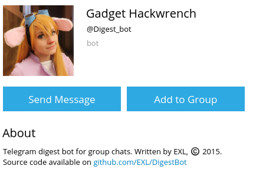

Digest Bot
==========



Telegram digest bot for group chats. Final version is 1.0.7, deprecated in favor to [Digest](https://github.com/EXL/Digest) project.

Bot records all messages with the `#digest` tag and displays them on the `/digest` command. Thanks to the creators of [node-telegram-bot-api](https://github.com/yagop/node-telegram-bot-api) and the creators of [Node.js](https://nodejs.org/en/) — powerful and awesome JavaScript framework.

## Install instructions

For example, GNU/Linux:

* Install the **Node.js** and the `npm` Node.js package manager;

```sh
sudo apt-get install nodejs
sudo apt-get install npm
```

* Clone repository into deploy directory;

```sh
cd ~/Deploy/
git clone https://github.com/EXL/DigestBot DigestBotDeploy
```

* Install **node-telegram-bot-api**, **request** and others modules into deploy directory;

```sh
cd ~/Deploy/DigestBotDeploy/
npm install # or npm ci
```

* Write your token in *BOT_TOKEN_ACCESS.json* file.

* Run with `node DigestBot` or `nodejs DigestBot` and enjoy!

## Additional information

* Please read [big tutorial (in Russian)](http://exlmoto.ru/writing-telegram-bots/) about creating various bots for Telegram.

* New [Digest](https://github.com/EXL/Digest) comprehensive project based on Spring Boot and [Java Telegram Bot API](https://github.com/pengrad/java-telegram-bot-api) implementation by [@pengrad](https://github.com/pengrad).
